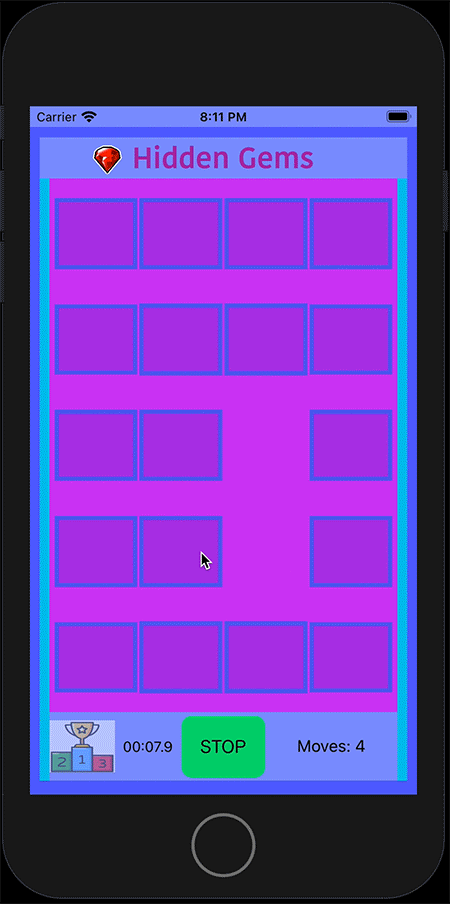

# <p align="center">iOS Game </p>

<br>

<h2 align="center">Card Matching Game</h3>

<p align="center"> <a href="https://developer.apple.com/swift/" target="_blank" rel="noreferrer"> &nbsp;&nbsp;&nbsp;&nbsp;&nbsp;&nbsp&nbsp; </a>  <a href="https://git-scm.com/" target="_blank" rel="noreferrer">  &nbsp;&nbsp;&nbsp;&nbsp;&nbsp;&nbsp&nbsp;</a>  <a href="https://developer.apple.com/swift/" target="_blank" rel="noreferrer">  </a> </p>

__Main concepts__: 

* Core Data
* UITapGestureRecognizers
* Stack Views
* Button Collections
* Custom HeaderFooterViews
* Custom TableView Cells
* Size Classes for iPhone & iPad
* Swift Timers
* User Interface Idiom
* AVAudioPlayer
* Custom Animation


__Extra functionality to add to the user experience__:


AudioPlayer


```Swift
// Audio Player
func playSound(sound: String, type: String = "mp3") {
        if let path = Bundle.main.path(forResource: sound, ofType: type) {
            do {
                let url = URL(fileURLWithPath: path)
                audioPlayer = try AVAudioPlayer(contentsOf: url)
                audioPlayer?.play()
            } catch {
                print("ERROR")
            }
        }
    }
```

<br>
<br>

<h2 align="center">** Please allow a few minutes for GIFs to load ** <br> Thank you so much</h2>

<br>
<br>

__Load Game Animation__

<p align="center">
  
</p>


___


__Animations for pulsating Start / Stop button__

__Flashing Colors__

<p align="center">
  
</p>

<p align="center">
  
</p>


___


__Card Shake Animation__

<p align="center">
  
</p>


___


__Custom Segue Transition__

<p align="center">
  
</p>


___

__Layout Changes__

<p align="center">
  
</p>


___


__iPad: Add Progress Bar & 10 Extra Cards__


<p align="center">
  
</p>

<br>
<br>


## [Click Here to View More iOS Illustrations](https://github.com/EShenoda/iOS-Illustrations)

<br>

##  Copyright
Private Repo for EmilShenodaDev@gmail.com

All rights reserved: EmilShenoda@FullSailUniversity

## Contact
Created by [Emil Shenoda](mailto:EmilShenodaDev@gmail.com) - feel free to contact me!


